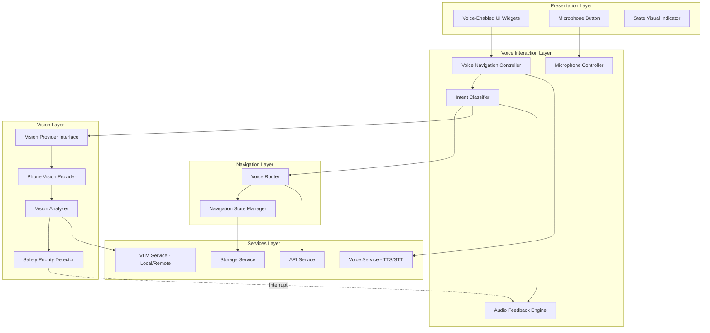

# Design Document: Voice-First Navigation Assistant

## Overview

The Voice-First Navigation Assistant is a comprehensive voice interaction system that transforms the Drishti mobile app into a fully voice-operable platform for visually impaired users. The system is built on three core pillars:

1. **Intent-Based Command Processing**: A structured intent classification system that maps natural language commands to specific actions with confidence scoring
2. **Unified Microphone State Management**: A single, predictable interaction model with four distinct states (Idle, Listening, Processing, Speaking)
3. **Safety-First Vision Analysis**: Intelligent vision processing with priority-based interrupts for hazard detection

The architecture follows Clean Architecture principles with clear separation between voice interaction, navigation, vision processing, and audio feedback layers. All components are designed to work both online (with backend services) and offline (with local models), ensuring reliability in all environments.

## Architecture

### High-Level Architecture



### Layer Responsibilities

**Presentation Layer**
- Voice-enabled widgets with semantic labels
- Microphone button with visual state indicator
- Haptic feedback integration
- Accessibility-first design

**Voice Interaction Layer**
- Central voice navigation controller orchestrating all voice interactions
- Microphone state machine (Idle → Listening → Processing → Speaking)
- Intent classification with confidence scoring
- Audio feedback generation and queueing

**Navigation Layer**
- Voice command to route mapping
- Navigation state management
- Screen transition handling
- Back stack management

**Vision Layer**
- Abstract vision provider interface
- Phone camera implementation
- Vision analysis coordination
- Safety-based priority interrupts

**Services Layer**
- TTS/STT via existing VoiceService
- VLM integration (local and remote)
- Backend API communication
- Local storage for offline support

## Components and Interfaces

### 1. Voice Navigation Controller

The central orchestrator for all voice interactions.

```dart
class VoiceNavigationController extends ChangeNotifier {
  final MicrophoneController _micController;
  final IntentClassifier _intentClassifier;
  final VoiceRouter _voiceRouter;
  final AudioFeedbackEngine _audioFeedback;
  final VisionProvider _visionProvider;
  
  // Current state
  VoiceNavigationState _state;
  
  // Initialize and start listening for wake word
  Future<void> initialize();
  
  // Handle microphone button tap
  Future<void> onMicrophoneTap();
  
  // Process voice command
  Future<void> processVoiceCommand(String command);
  
  // Handle classified intent
  Future<void> handleIntent(Intent intent);
  
  // Emergency interrupt
  Future<void> triggerEmergency();
  
  // Dispose resources
  @override
  void dispose();
}

enum VoiceNavigationState {
  idle,
  listening,
  processing,
  speaking,
  error,
}
```

### 2. Microphone Controller

Manages microphone states and transitions.

```dart
class MicrophoneController extends ChangeNotifier {
  final VoiceService _voiceService;
  
  MicrophoneState _state = MicrophoneState.idle;
  
  MicrophoneState get state => _state;
  
  // Start listening (from button tap or wake word)
  Future<void> startListening({
    required Function(String) onResult,
    Function(String)? onError,
  });
  
  // Stop listening
  Future<void> stopListening();
  
  // Transition to processing state
  void setProcessing();
  
  // Transition to speaking state
  void setSpeaking();
  
  // Return to idle state
  void setIdle();
  
  // Provide haptic feedback for state change
  void _provideHapticFeedback();
  
  // Provide audio cue for state change
  Future<void> _provideAudioCue();
}

enum MicrophoneState {
  idle,      // Ready to listen
  listening, // Actively recording
  processing,// Analyzing command
  speaking,  // Providing response
}
```

### 3. Intent Classifier

Classifies voice commands into structured intents.

```dart
class IntentClassifier {
  // Classify a voice command
  Future<ClassifiedIntent> classify(String command);
  
  // Get intent patterns for matching
  Map<IntentType, List<String>> _getIntentPatterns();
  
  // Calculate confidence score
  double _calculateConfidence(String command, IntentType type);
  
  // Extract parameters from command
  Map<String, dynamic> _extractParameters(String command, IntentType type);
}

class ClassifiedIntent {
  final IntentType type;
  final double confidence;
  final Map<String, dynamic> parameters;
  final String originalCommand;
  
  const ClassifiedIntent({
    required this.type,
    required this.confidence,
    required this.parameters,
    required this.originalCommand,
  });
  
  bool get isConfident => confidence >= 0.6;
}

enum IntentType {
  navigation,  // Go to screen, go back, home
  vision,      // Scan, what's in front, obstacles
  relative,    // Who is near, is X nearby
  auth,        // Sign in, sign up, log out
  settings,    // Volume, language, vibration
  system,      // Battery, connection status
  emergency,   // Help, emergency, call contact
}
```

### 4. Voice Router

Translates navigation intents into screen transitions.

```dart
class VoiceRouter {
  final GoRouter _router;
  final AudioFeedbackEngine _audioFeedback;
  
  // Route to screen based on intent
  Future<void> routeFromIntent(ClassifiedIntent intent);
  
  // Navigate to specific screen
  Future<void> navigateTo(String routeName);
  
  // Go back
  Future<void> goBack();
  
  // Go to home
  Future<void> goHome();
  
  // Announce current screen
  Future<void> announceCurrentScreen();
  
  // Get available actions for current screen
  List<String> getAvailableActions();
}

// Route name constants
class VoiceRoutes {
  static const String home = '/home';
  static const String dashboard = '/dashboard';
  static const String settings = '/settings';
  static const String profile = '/profile';
  static const String relatives = '/relatives';
  static const String activity = '/activity';
  static const String vision = '/vision';
  static const String auth = '/auth';
}
```

### 5. Audio Feedback Engine

Generates and manages audio responses.

```dart
class AudioFeedbackEngine {
  final VoiceService _voiceService;
  final Queue<AudioMessage> _messageQueue = Queue();
  bool _isSpeaking = false;
  
  // Speak a message (queued)
  Future<void> speak(String message, {AudioPriority priority = AudioPriority.normal});
  
  // Speak immediately (interrupt current)
  Future<void> speakImmediate(String message);
  
  // Announce screen
  Future<void> announceScreen(String screenName, List<String> actions);
  
  // Confirm action
  Future<void> confirmAction(String action);
  
  // Report error
  Future<void> reportError(String error);
  
  // Provide navigation feedback
  Future<void> announceNavigation(String destination);
  
  // Format vision response (max 2 sentences, clock directions)
  String formatVisionResponse(String rawResponse);
  
  // Clear queue
  void clearQueue();
  
  // Process queue
  Future<void> _processQueue();
}

enum AudioPriority {
  low,       // Can be skipped
  normal,    // Standard queue
  high,      // Jump to front of queue
  emergency, // Interrupt everything
}

class AudioMessage {
  final String text;
  final AudioPriority priority;
  final DateTime timestamp;
  
  const AudioMessage({
    required this.text,
    required this.priority,
    required this.timestamp,
  });
}
```

### 6. Vision Provider (Abstract Interface)

```dart
abstract class VisionProvider {
  // Capture and analyze current view
  Future<VisionResult> analyzeCurrentView({String? customPrompt});
  
  // Detect obstacles
  Future<VisionResult> detectObstacles();
  
  // Identify people
  Future<VisionResult> identifyPeople();
  
  // Read text
  Future<VisionResult> readText();
  
  // Check for hazards
  Future<SafetyResult> checkForHazards();
  
  // Get current frame
  Future<Uint8List?> getCurrentFrame();
}

class VisionResult {
  final String description;
  final List<DetectedObject> objects;
  final Duration processingTime;
  final bool usedLocalModel;
  
  const VisionResult({
    required this.description,
    required this.objects,
    required this.processingTime,
    required this.usedLocalModel,
  });
}

class DetectedObject {
  final String label;
  final double confidence;
  final BoundingBox boundingBox;
  final ClockPosition clockPosition;
  
  const DetectedObject({
    required this.label,
    required this.confidence,
    required this.boundingBox,
    required this.clockPosition,
  });
}

class ClockPosition {
  final int hour; // 1-12
  final String description; // "at 3 o'clock", "directly ahead"
  
  const ClockPosition(this.hour, this.description);
}

class SafetyResult {
  final bool hasDanger;
  final List<Hazard> hazards;
  final String warningMessage;
  
  const SafetyResult({
    required this.hasDanger,
    required this.hazards,
    required this.warningMessage,
  });
}

class Hazard {
  final String type; // vehicle, stairs, hole, obstacle
  final HazardLevel level;
  final ClockPosition position;
  final double distance; // meters (estimated)
  
  const Hazard({
    required this.type,
    required this.level,
    required this.position,
    required this.distance,
  });
}

enum HazardLevel {
  low,      // Awareness needed
  medium,   // Caution required
  high,     // Immediate attention
  critical, // Stop immediately
}
```

### 7. Phone Vision Provider (Implementation)

```dart
class PhoneVisionProvider implements VisionProvider {
  final CameraController _cameraController;
  final LocalVLMService _localVLM;
  final APIService _apiService;
  final SafetyPriorityDetector _safetyDetector;
  
  bool _useLocalModel = false;
  
  // Initialize camera
  Future<void> initialize();
  
  @override
  Future<VisionResult> analyzeCurrentView({String? customPrompt}) async {
    // Capture frame
    final frame = await _captureFrame();
    
    // Try backend first, fall back to local
    try {
      if (!_useLocalModel) {
        return await _analyzeWithBackend(frame, customPrompt);
      }
    } catch (e) {
      _useLocalModel = true;
    }
    
    return await _analyzeWithLocal(frame, customPrompt);
  }
  
  @override
  Future<SafetyResult> checkForHazards() async {
    final frame = await _captureFrame();
    return await _safetyDetector.detectHazards(frame);
  }
  
  // Capture single frame
  Future<Uint8List> _captureFrame();
  
  // Analyze with backend VLM
  Future<VisionResult> _analyzeWithBackend(Uint8List frame, String? prompt);
  
  // Analyze with local VLM
  Future<VisionResult> _analyzeWithLocal(Uint8List frame, String? prompt);
  
  // Convert bounding box to clock position
  ClockPosition _toClockPosition(BoundingBox box);
}
```

### 8. Safety Priority Detector

```dart
class SafetyPriorityDetector {
  // Detect hazards in frame
  Future<SafetyResult> detectHazards(Uint8List frame);
  
  // Classify hazard level
  HazardLevel _classifyHazardLevel(DetectedObject object);
  
  // Check if object is dangerous
  bool _isDangerous(String label);
  
  // Estimate distance from bounding box
  double _estimateDistance(BoundingBox box);
  
  // Generate warning message
  String _generateWarning(List<Hazard> hazards);
}

// Dangerous object categories
const List<String> dangerousObjects = [
  'car', 'vehicle', 'truck', 'bus', 'motorcycle',
  'stairs', 'staircase', 'step',
  'hole', 'pit', 'gap',
  'fire', 'flame',
  'water', 'pool', 'pond',
  'cliff', 'edge', 'drop',
];
```

### 9. Voice Auth Handler

```dart
class VoiceAuthHandler {
  final VoiceService _voiceService;
  final AuthService _authService;
  final AudioFeedbackEngine _audioFeedback;
  
  // Start voice sign-in flow
  Future<void> startVoiceSignIn();
  
  // Start voice sign-up flow
  Future<void> startVoiceSignUp();
  
  // Collect phone number via voice
  Future<String> collectPhoneNumber();
  
  // Confirm phone number
  Future<bool> confirmPhoneNumber(String phoneNumber);
  
  // Collect OTP via voice
  Future<String> collectOTP();
  
  // Guide face registration
  Future<void> guideFaceRegistration();
  
  // Parse spoken digits
  String _parseSpokenDigits(String spoken);
}
```

### 10. Settings Voice Controller

```dart
class SettingsVoiceController {
  final VoiceService _voiceService;
  final StorageService _storageService;
  final AudioFeedbackEngine _audioFeedback;
  
  // Handle settings intent
  Future<void> handleSettingsIntent(ClassifiedIntent intent);
  
  // Adjust volume
  Future<void> adjustVolume(VolumeDirection direction);
  
  // Adjust speech rate
  Future<void> adjustSpeechRate(SpeedDirection direction);
  
  // Toggle vibration
  Future<void> toggleVibration();
  
  // Change language
  Future<void> changeLanguage();
  
  // Set emergency contact
  Future<void> setEmergencyContact();
  
  // Get current settings
  Future<Map<String, dynamic>> getCurrentSettings();
  
  // Announce setting change
  Future<void> _announceChange(String setting, dynamic value);
}

enum VolumeDirection { up, down }
enum SpeedDirection { faster, slower }
```

## Data Models

### Intent Schema

```dart
// Intent patterns for classification
class IntentPatterns {
  static const Map<IntentType, List<String>> patterns = {
    IntentType.navigation: [
      'go to',
      'open',
      'navigate to',
      'show me',
      'take me to',
      'go back',
      'back',
      'home',
      'main screen',
    ],
    IntentType.vision: [
      'what',
      'describe',
      'see',
      'look',
      'scan',
      'analyze',
      'in front',
      'ahead',
      'obstacle',
      'around me',
    ],
    IntentType.relative: [
      'who',
      'is',
      'near',
      'nearby',
      'close',
      'recognize',
      'identify person',
    ],
    IntentType.auth: [
      'sign in',
      'log in',
      'sign up',
      'register',
      'log out',
      'sign out',
    ],
    IntentType.settings: [
      'volume',
      'louder',
      'quieter',
      'speed',
      'faster',
      'slower',
      'language',
      'vibration',
      'haptic',
      'emergency contact',
    ],
    IntentType.system: [
      'battery',
      'connection',
      'connected',
      'online',
      'offline',
      'status',
    ],
    IntentType.emergency: [
      'help',
      'emergency',
      'urgent',
      'call',
      'sos',
    ],
  };
  
  // Screen name mappings
  static const Map<String, String> screenMappings = {
    'settings': VoiceRoutes.settings,
    'setting': VoiceRoutes.settings,
    'dashboard': VoiceRoutes.dashboard,
    'home': VoiceRoutes.home,
    'profile': VoiceRoutes.profile,
    'relatives': VoiceRoutes.relatives,
    'family': VoiceRoutes.relatives,
    'activity': VoiceRoutes.activity,
    'history': VoiceRoutes.activity,
    'vision': VoiceRoutes.vision,
    'camera': VoiceRoutes.vision,
  };
}
```

### Analytics Data Model

```dart
class VoiceAnalytics {
  final String userId;
  final DateTime date;
  final int totalInteractions;
  final int successfulScans;
  final int emergencyTriggers;
  final Map<IntentType, int> intentCounts;
  final DeviceHealth deviceHealth;
  
  const VoiceAnalytics({
    required this.userId,
    required this.date,
    required this.totalInteractions,
    required this.successfulScans,
    required this.emergencyTriggers,
    required this.intentCounts,
    required this.deviceHealth,
  });
  
  Map<String, dynamic> toJson();
  factory VoiceAnalytics.fromJson(Map<String, dynamic> json);
}

class DeviceHealth {
  final int batteryLevel;
  final bool isConnected;
  final bool isCameraAvailable;
  final bool isMicrophoneAvailable;
  final DateTime lastChecked;
  
  const DeviceHealth({
    required this.batteryLevel,
    required this.isConnected,
    required this.isCameraAvailable,
    required this.isMicrophoneAvailable,
    required this.lastChecked,
  });
}
```

### Voice Navigation State

```dart
class VoiceNavigationStateData {
  final MicrophoneState microphoneState;
  final String? currentScreen;
  final ClassifiedIntent? lastIntent;
  final VisionResult? lastVisionResult;
  final List<String> conversationHistory;
  final bool isEmergencyMode;
  final bool isOfflineMode;
  
  const VoiceNavigationStateData({
    required this.microphoneState,
    this.currentScreen,
    this.lastIntent,
    this.lastVisionResult,
    required this.conversationHistory,
    required this.isEmergencyMode,
    required this.isOfflineMode,
  });
  
  VoiceNavigationStateData copyWith({...});
}
```


## Correctness Properties

A property is a characteristic or behavior that should hold true across all valid executions of a system—essentially, a formal statement about what the system should do. Properties serve as the bridge between human-readable specifications and machine-verifiable correctness guarantees.

### Property Reflection

After analyzing all acceptance criteria, I identified several areas where properties can be consolidated:

1. **Audio Feedback Properties**: Multiple criteria require audio feedback for different events (actions, errors, navigation, settings). These can be consolidated into comprehensive properties about feedback completeness.

2. **State Transition Properties**: Multiple criteria about microphone states and navigation states can be consolidated into properties about state machine correctness.

3. **Intent Recognition Properties**: Individual intent type recognition can be tested through examples, while the classification rules (confidence, uniqueness) are universal properties.

4. **Offline Mode Properties**: Multiple offline behaviors can be consolidated into a single property about offline functionality preservation.

5. **Priority System Properties**: Emergency and safety priority behaviors can be consolidated into properties about priority ordering.

### Core Properties

**Property 1: Complete Voice Command Coverage**
*For any* screen in the application and any user action on that screen, there SHALL exist a voice command that can trigger that action.
**Validates: Requirements 1.1, 1.2**

**Property 2: Universal Audio Feedback**
*For any* user action that completes successfully, the Audio Feedback Engine SHALL provide spoken confirmation within 500ms of completion.
**Validates: Requirements 1.3**

**Property 3: User-Friendly Error Messages**
*For any* error that occurs in the system, the error message spoken by the Audio Feedback Engine SHALL contain no technical jargon (no terms like "exception", "null pointer", "stack trace", "HTTP 500").
**Validates: Requirements 1.4, 8.6**

**Property 4: Touch Fallback Preservation**
*For any* voice-accessible action, triggering that action via touch SHALL produce the same result as triggering it via voice.
**Validates: Requirements 1.5**

**Property 5: State Transition Audio Cues**
*For any* pair of distinct microphone states (Idle, Listening, Processing, Speaking), the audio cue for transitioning between them SHALL be unique and distinguishable.
**Validates: Requirements 2.4**

**Property 6: Visual State Indicator Consistency**
*For any* microphone state, the visual indicator SHALL accurately reflect the current state at all times.
**Validates: Requirements 2.6**

**Property 7: Single Intent Classification**
*For any* voice command, the Intent Classifier SHALL return exactly one classified intent (not zero, not multiple).
**Validates: Requirements 3.1**

**Property 8: Confidence Score Bounds**
*For any* voice command classification, the confidence score SHALL be a value between 0.0 and 1.0 inclusive.
**Validates: Requirements 3.2**

**Property 9: Low Confidence Clarification**
*For any* classified intent with confidence score below 0.6, the Audio Feedback Engine SHALL request clarification from the user.
**Validates: Requirements 3.3**

**Property 10: Highest Confidence Selection**
*For any* voice command that matches multiple intent patterns, the Intent Classifier SHALL select the intent with the highest confidence score.
**Validates: Requirements 3.11**

**Property 11: Vision Analysis Routing**
*For any* captured camera frame, the Phone Vision Provider SHALL send it to exactly one VLM service (either backend or local, not both, not neither).
**Validates: Requirements 4.4**

**Property 12: Two-Sentence Response Limit**
*For any* vision analysis result, the spoken response SHALL contain at most two sentences.
**Validates: Requirements 4.6, 5.1**

**Property 13: No Filler Phrases**
*For any* vision analysis response, the text SHALL NOT contain filler phrases from the set {"I see", "The image shows", "It appears", "It looks like", "I can see"}.
**Validates: Requirements 5.2**

**Property 14: Clock Direction Usage**
*For any* object location description in a vision response, if a directional reference is included, it SHALL use clock direction format (e.g., "at 3 o'clock", "at 12 o'clock").
**Validates: Requirements 5.3**

**Property 15: Safety Information Priority**
*For any* vision response containing hazard information, the hazard description SHALL appear in the first sentence.
**Validates: Requirements 5.4**

**Property 16: Voice Auth Audio Confirmation**
*For any* step in the voice authentication flow (phone number collection, OTP collection, face registration), the Voice Auth Handler SHALL provide audio confirmation before proceeding to the next step.
**Validates: Requirements 6.7**

**Property 17: Keyboard-Free Authentication**
*For any* authentication flow initiated via voice, no keyboard input events SHALL be triggered during the entire flow.
**Validates: Requirements 6.8**

**Property 18: Navigation Announcement**
*For any* successful navigation to a new screen, the Audio Feedback Engine SHALL announce the destination screen name within 500ms of arrival.
**Validates: Requirements 7.8**

**Property 19: Complete Bottom Nav Voice Coverage**
*For any* screen accessible via the bottom navigation bar, there SHALL exist at least one voice command that navigates to that screen.
**Validates: Requirements 7.9**

**Property 20: User-Friendly Unexpected Errors**
*For any* unexpected error (errors not explicitly handled), the Audio Feedback Engine SHALL provide an explanation that contains no technical terms and suggests a user action.
**Validates: Requirements 8.5**

**Property 21: Dangerous Object Interruption**
*For any* detected dangerous object, the Safety Priority System SHALL interrupt the current operation and speak the warning within 200ms of detection.
**Validates: Requirements 9.1, 9.2**

**Property 22: Dangerous Object Screen Override**
*For any* detected dangerous object, the Safety Priority System SHALL override the current screen to display the warning.
**Validates: Requirements 9.3**

**Property 23: Safety Priority Ordering**
*For any* pair of audio messages where one is a safety warning and the other is not, the safety warning SHALL be spoken first regardless of queue order.
**Validates: Requirements 9.4**

**Property 24: Dangerous Object Classification**
*For any* detected object, if its label matches the dangerous objects list AND its estimated distance is less than 3 meters, it SHALL be classified as a hazard.
**Validates: Requirements 9.5**

**Property 25: Settings Change Confirmation**
*For any* setting that is modified via voice command, the Audio Feedback Engine SHALL announce the setting name and new value within 500ms.
**Validates: Requirements 10.9**

**Property 26: Analytics Metric Tracking**
*For any* voice interaction, vision scan, or emergency trigger, the corresponding analytics counter SHALL increment by exactly 1.
**Validates: Requirements 11.1, 11.2, 11.3**

**Property 27: Emergency Priority Maximum**
*For any* classified intent, if the intent type is EMERGENCY, its priority SHALL be higher than all other intent types.
**Validates: Requirements 12.5**

**Property 28: Emergency Override**
*For any* operation in progress, when an emergency intent is detected, that operation SHALL be interrupted and the emergency handler SHALL execute.
**Validates: Requirements 12.6**

**Property 29: Offline Voice Command Processing**
*For any* voice command classified as NAVIGATION, SETTINGS, or SYSTEM intent, the command SHALL be processed successfully regardless of network connectivity.
**Validates: Requirements 13.1, 13.3**

**Property 30: Semantic Label Completeness**
*For any* interactive UI element (button, input, control), the element SHALL have a non-empty semantic label.
**Validates: Requirements 14.1**

**Property 31: Voice Alternative Completeness**
*For any* button in the UI, there SHALL exist at least one voice command that triggers the same action as tapping that button.
**Validates: Requirements 14.2**

**Property 32: Screen Load Announcement**
*For any* screen that loads, the Audio Feedback Engine SHALL announce the screen name and list available actions within 1 second of load completion.
**Validates: Requirements 14.3**

**Property 33: State Change Haptic Feedback**
*For any* state transition in the Microphone Controller, haptic feedback SHALL be triggered.
**Validates: Requirements 14.4**

**Property 34: Minimum Touch Target Size**
*For any* interactive UI element, the touch target size SHALL be at least 48x48 density-independent pixels.
**Validates: Requirements 14.5**

**Property 35: Image Context Preservation**
*For any* vision scan followed by a follow-up question, the Vision Provider SHALL use the same image for analysis without re-capturing.
**Validates: Requirements 15.1, 15.2**

**Property 36: Context Clearing on New Scan**
*For any* new vision scan initiated, if there was a previous vision context, that context SHALL be cleared before the new scan begins.
**Validates: Requirements 15.5**

## Error Handling

### Error Categories

**1. User Input Errors**
- Unrecognized voice commands → "I didn't understand. Please repeat."
- Low confidence classification → "I'm not sure what you meant. Could you rephrase?"
- Ambiguous commands → "Did you mean [option 1] or [option 2]?"

**2. Hardware Errors**
- Camera unavailable → "Camera not available. Trying again."
- Microphone permission denied → "Microphone access required. Please enable in settings."
- Camera permission denied → "Camera access required. Please enable in settings."

**3. Network Errors**
- Connection lost → "Connection lost. Using offline mode."
- Backend timeout → "Taking longer than expected. Switching to local processing."
- API error → "Service temporarily unavailable. Using offline features."

**4. System Errors**
- Low battery → "Battery low. Some features may be limited."
- Storage full → "Storage full. Please free up space."
- Unexpected errors → "Something went wrong. Please try again."

### Error Handling Strategy

```dart
class VoiceErrorHandler {
  final AudioFeedbackEngine _audioFeedback;
  final VoiceNavigationController _controller;
  
  // Handle error with user-friendly message
  Future<void> handleError(Exception error, {String? context}) async {
    final message = _getUserFriendlyMessage(error);
    await _audioFeedback.speak(message, priority: AudioPriority.high);
    
    // Log technical details for debugging
    _logError(error, context);
    
    // Attempt recovery if possible
    await _attemptRecovery(error);
  }
  
  // Convert technical error to user-friendly message
  String _getUserFriendlyMessage(Exception error) {
    if (error is CameraException) {
      return "Camera not available. Trying again.";
    } else if (error is NetworkException) {
      return "Connection lost. Using offline mode.";
    } else if (error is PermissionException) {
      return "${error.permission} access required. Please enable in settings.";
    } else if (error is TimeoutException) {
      return "Taking longer than expected. Please wait.";
    } else {
      return "Something went wrong. Please try again.";
    }
  }
  
  // Attempt automatic recovery
  Future<void> _attemptRecovery(Exception error) async {
    if (error is NetworkException) {
      _controller.enableOfflineMode();
    } else if (error is CameraException) {
      await Future.delayed(Duration(seconds: 2));
      await _controller.retryCamera();
    }
  }
}
```

### Error Recovery Flows

**Camera Failure Recovery**
1. Detect camera unavailable
2. Announce: "Camera not available. Trying again."
3. Wait 2 seconds
4. Retry camera initialization
5. If still fails after 3 attempts: "Camera unavailable. Please check permissions."

**Network Failure Recovery**
1. Detect network unavailable
2. Announce: "Connection lost. Using offline mode."
3. Switch to local VLM
4. Continue with offline features
5. Monitor for reconnection
6. When reconnected: "Connection restored."

**Permission Denial Recovery**
1. Detect permission denied
2. Announce: "[Permission] access required. Please enable in settings."
3. Provide voice command to open settings: "Say 'open settings' to enable."
4. Wait for user action
5. Re-check permission after settings return

## Testing Strategy

### Dual Testing Approach

The voice-first navigation system requires both unit tests and property-based tests for comprehensive coverage:

**Unit Tests** focus on:
- Specific voice command examples ("Go to settings" → settings screen)
- Edge cases (empty commands, very long commands, special characters)
- Error conditions (camera unavailable, network timeout, permission denied)
- State machine transitions (Idle → Listening → Processing → Speaking)
- Integration points (VoiceService, VLMService, APIService)

**Property-Based Tests** focus on:
- Universal properties across all inputs (confidence scores always 0.0-1.0)
- Comprehensive input coverage (random voice commands, random screens, random errors)
- Invariants (exactly one intent per command, audio feedback for all actions)
- Round-trip properties (voice command → action → confirmation)

### Property-Based Testing Configuration

**Testing Library**: Use `faker` package for Dart to generate random test data

**Test Configuration**:
- Minimum 100 iterations per property test
- Each property test references its design document property number
- Tag format: `@Tags(['voice-first-navigation', 'property-1'])`

**Example Property Test Structure**:

```dart
@Tags(['voice-first-navigation', 'property-8'])
test('Property 8: Confidence scores are always between 0.0 and 1.0', () async {
  final classifier = IntentClassifier();
  final faker = Faker();
  
  for (int i = 0; i < 100; i++) {
    // Generate random command
    final command = faker.lorem.sentence();
    
    // Classify
    final intent = await classifier.classify(command);
    
    // Verify confidence bounds
    expect(intent.confidence, greaterThanOrEqualTo(0.0));
    expect(intent.confidence, lessThanOrEqualTo(1.0));
  }
});
```

### Unit Test Examples

**Intent Classification Tests**:
```dart
group('Intent Classification', () {
  test('recognizes navigation intent for "go to settings"', () async {
    final classifier = IntentClassifier();
    final intent = await classifier.classify('go to settings');
    
    expect(intent.type, equals(IntentType.navigation));
    expect(intent.parameters['screen'], equals('settings'));
    expect(intent.confidence, greaterThan(0.6));
  });
  
  test('recognizes vision intent for "what\'s in front of me"', () async {
    final classifier = IntentClassifier();
    final intent = await classifier.classify('what\'s in front of me');
    
    expect(intent.type, equals(IntentType.vision));
    expect(intent.confidence, greaterThan(0.6));
  });
  
  test('recognizes emergency intent for "help"', () async {
    final classifier = IntentClassifier();
    final intent = await classifier.classify('help');
    
    expect(intent.type, equals(IntentType.emergency));
    expect(intent.confidence, greaterThan(0.8));
  });
});
```

**Audio Feedback Tests**:
```dart
group('Audio Feedback', () {
  test('limits vision responses to two sentences', () {
    final engine = AudioFeedbackEngine(mockVoiceService);
    final longResponse = 'This is sentence one. This is sentence two. This is sentence three.';
    
    final formatted = engine.formatVisionResponse(longResponse);
    
    final sentenceCount = '.'.allMatches(formatted).length;
    expect(sentenceCount, lessThanOrEqualTo(2));
  });
  
  test('removes filler phrases from responses', () {
    final engine = AudioFeedbackEngine(mockVoiceService);
    final response = 'I see a car in the image. The image shows a person.';
    
    final formatted = engine.formatVisionResponse(response);
    
    expect(formatted, isNot(contains('I see')));
    expect(formatted, isNot(contains('The image shows')));
  });
  
  test('uses clock directions for object locations', () {
    final engine = AudioFeedbackEngine(mockVoiceService);
    final object = DetectedObject(
      label: 'car',
      confidence: 0.9,
      boundingBox: BoundingBox(x: 0.8, y: 0.5, width: 0.2, height: 0.3),
      clockPosition: ClockPosition(3, 'at 3 o\'clock'),
    );
    
    final description = engine.describeObject(object);
    
    expect(description, contains('o\'clock'));
  });
});
```

**Safety Priority Tests**:
```dart
group('Safety Priority System', () {
  test('interrupts current operation for dangerous object', () async {
    final controller = VoiceNavigationController(...);
    final mockAudioFeedback = MockAudioFeedbackEngine();
    
    // Start a normal operation
    await controller.processVoiceCommand('go to settings');
    
    // Detect dangerous object
    final hazard = Hazard(
      type: 'vehicle',
      level: HazardLevel.critical,
      position: ClockPosition(12, 'directly ahead'),
      distance: 2.0,
    );
    
    await controller.handleSafetyWarning(hazard);
    
    // Verify warning was spoken immediately
    verify(mockAudioFeedback.speakImmediate(any)).called(1);
    
    // Verify navigation was interrupted
    expect(controller.currentScreen, isNot(equals('/settings')));
  });
  
  test('assigns highest priority to emergency intents', () {
    final classifier = IntentClassifier();
    
    final emergencyIntent = ClassifiedIntent(
      type: IntentType.emergency,
      confidence: 0.9,
      parameters: {},
      originalCommand: 'help',
    );
    
    final navigationIntent = ClassifiedIntent(
      type: IntentType.navigation,
      confidence: 0.95,
      parameters: {},
      originalCommand: 'go to settings',
    );
    
    expect(emergencyIntent.priority, greaterThan(navigationIntent.priority));
  });
});
```

### Integration Tests

**End-to-End Voice Navigation**:
```dart
testWidgets('complete voice navigation flow', (tester) async {
  await tester.pumpWidget(MyApp());
  
  // Tap microphone button
  await tester.tap(find.byType(MicrophoneButton));
  await tester.pumpAndSettle();
  
  // Simulate voice command
  final voiceService = tester.widget<VoiceService>(find.byType(VoiceService));
  voiceService.simulateVoiceInput('go to settings');
  await tester.pumpAndSettle();
  
  // Verify navigation to settings
  expect(find.text('Settings'), findsOneWidget);
  
  // Verify audio feedback was provided
  verify(mockAudioFeedback.speak('Navigating to settings')).called(1);
});
```

**Offline Mode Integration**:
```dart
testWidgets('voice navigation works offline', (tester) async {
  // Disable network
  await NetworkSimulator.goOffline();
  
  await tester.pumpWidget(MyApp());
  
  // Verify offline mode announcement
  verify(mockAudioFeedback.speak('Offline mode active')).called(1);
  
  // Test navigation still works
  await tester.tap(find.byType(MicrophoneButton));
  await tester.pumpAndSettle();
  
  final voiceService = tester.widget<VoiceService>(find.byType(VoiceService));
  voiceService.simulateVoiceInput('go to profile');
  await tester.pumpAndSettle();
  
  expect(find.text('Profile'), findsOneWidget);
});
```

### Test Coverage Goals

- **Unit Test Coverage**: 80% code coverage minimum
- **Property Test Coverage**: All 36 correctness properties implemented
- **Integration Test Coverage**: All critical user flows (auth, navigation, vision, emergency)
- **Accessibility Test Coverage**: All screens tested with screen reader simulation

### Continuous Testing

- Run unit tests on every commit
- Run property tests nightly (due to longer execution time)
- Run integration tests before each release
- Monitor test execution time and optimize slow tests
- Track flaky tests and fix root causes

## Implementation Notes

### Wake Word Detection

The wake phrase "Hey Drishti" requires continuous listening in the background. Implementation options:

**Option 1: Use existing speech_to_text plugin with continuous listening**
- Pros: No additional dependencies
- Cons: Higher battery drain, may not work reliably in background

**Option 2: Use dedicated wake word detection library (e.g., Porcupine)**
- Pros: Optimized for wake word detection, lower battery drain
- Cons: Additional dependency, may require licensing

**Recommendation**: Start with Option 1 for MVP, evaluate Option 2 based on battery impact feedback.

### Vision Analysis Optimization

To minimize latency for vision analysis:

1. **Pre-warm camera**: Initialize camera on app start, keep it ready
2. **Frame caching**: Cache last captured frame for follow-up questions
3. **Parallel processing**: Send frame to both backend and local VLM simultaneously, use whichever responds first
4. **Response streaming**: Stream VLM tokens as they're generated for faster perceived response time

### Offline Mode Strategy

**Always Available Offline**:
- Voice command classification (pattern matching)
- Navigation between screens
- Settings adjustments
- Audio feedback
- Local VLM for vision analysis

**Requires Online**:
- Backend VLM for vision analysis (falls back to local)
- Face recognition for relatives
- Analytics sync
- Emergency contact calling (uses device dialer)

### Accessibility Considerations

**Screen Reader Compatibility**:
- All voice commands also work with TalkBack/VoiceOver
- Semantic labels on all UI elements
- Proper focus management for screen readers

**Haptic Feedback Patterns**:
- Single tap: Button press
- Double tap: State change
- Long vibration: Error
- Short pulse: Success
- Rapid pulses: Warning/danger

**Audio Cue Design**:
- Idle → Listening: Rising tone
- Listening → Processing: Processing beep
- Processing → Speaking: Descending tone
- Error: Error sound
- Success: Success chime

### Performance Targets

- **Voice command latency**: < 500ms from speech end to action start
- **Vision analysis latency**: < 3s for local VLM, < 2s for backend VLM
- **Audio feedback latency**: < 200ms from action completion to speech start
- **Safety warning latency**: < 200ms from detection to warning speech
- **Screen transition latency**: < 300ms from command to new screen

### Security Considerations

**Voice Authentication Security**:
- OTP spoken aloud is a security risk in public spaces
- Mitigation: Provide option to use haptic feedback for OTP confirmation (vibration patterns)
- Alternative: Allow user to request "private mode" where OTP is not spoken

**Emergency Contact Privacy**:
- Emergency contact information is sensitive
- Store encrypted in local storage
- Require authentication to view/modify

**Camera Privacy**:
- Always show visual indicator when camera is active
- Provide voice command to disable camera: "Stop camera"
- Clear camera buffer after analysis

### Localization Support

**Supported Languages** (Phase 1):
- English (US)
- Hindi
- Spanish

**Localization Requirements**:
- All audio feedback messages in strings.dart
- Intent patterns for each language
- Clock direction translations
- Number parsing for each language (phone numbers, OTP)

**Future Languages**:
- French, German, Mandarin, Arabic, Portuguese

### Analytics Events

Track the following events for analytics:

```dart
enum VoiceAnalyticsEvent {
  voiceCommandIssued,
  intentClassified,
  navigationCompleted,
  visionScanCompleted,
  emergencyTriggered,
  errorOccurred,
  offlineModeActivated,
  settingChanged,
  authFlowCompleted,
  safetyWarningIssued,
}
```

Each event includes:
- Timestamp
- User ID
- Event type
- Event parameters (intent type, screen name, error type, etc.)
- Device context (battery level, connectivity, camera status)

### Future Enhancements

**Phase 2 Features**:
- Raspberry Pi vision provider implementation
- Multi-language support expansion
- Custom wake word training
- Voice profile personalization
- Conversation context across sessions
- Voice shortcuts for frequent actions

**Phase 3 Features**:
- Natural language understanding (NLU) for more flexible commands
- Voice-based app customization
- Integration with smart home devices
- Voice-controlled navigation assistance (GPS integration)
- Social features (voice messages to relatives)
